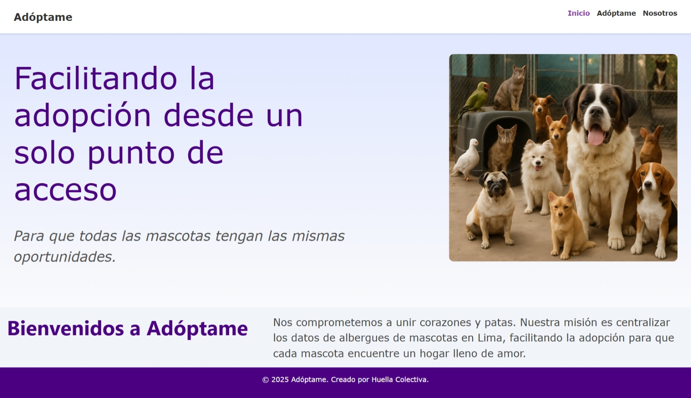
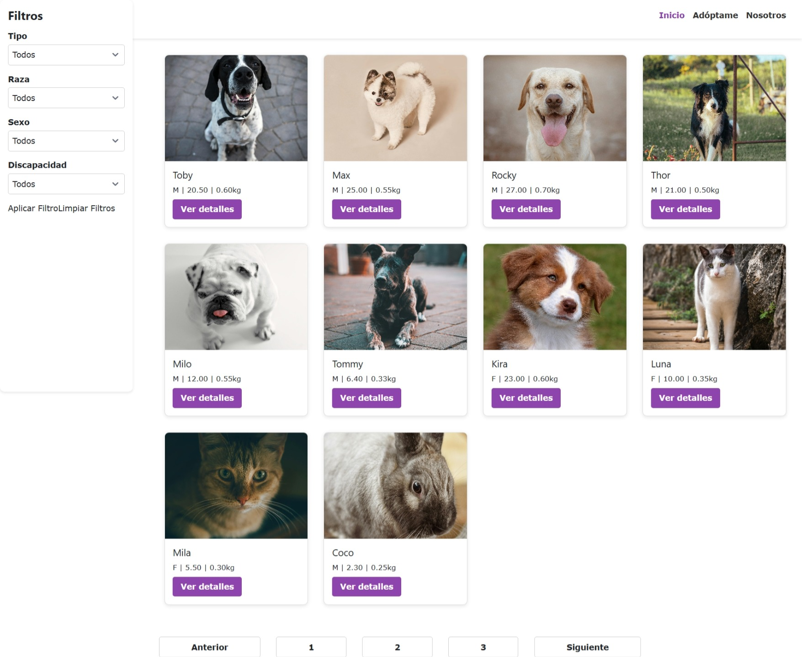
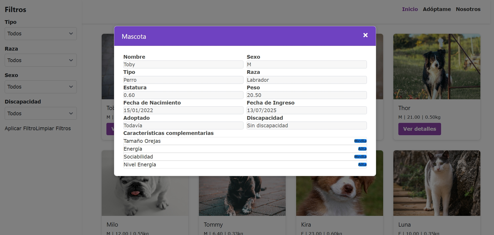
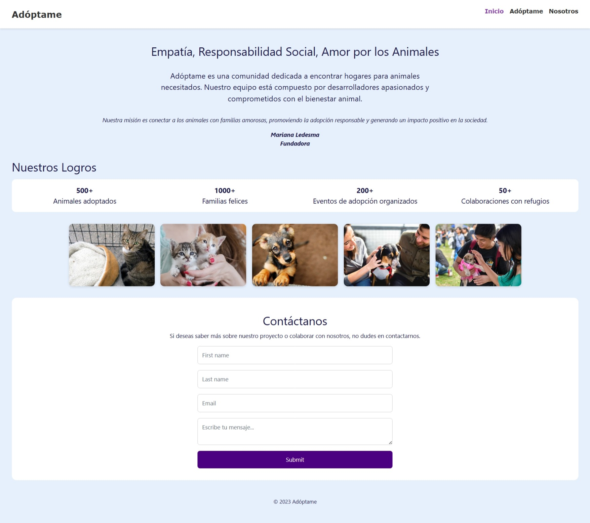
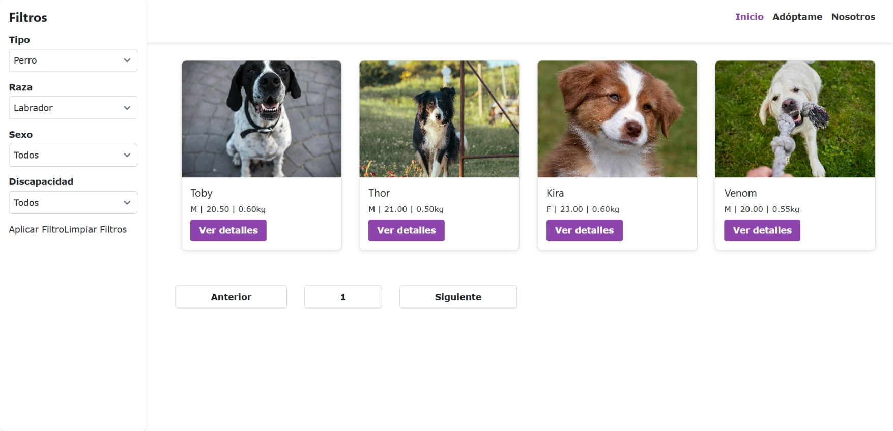
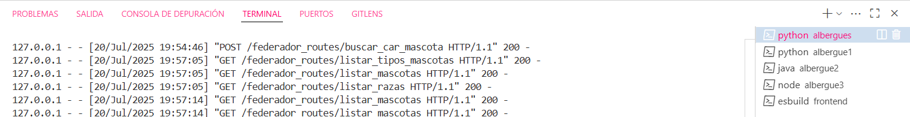
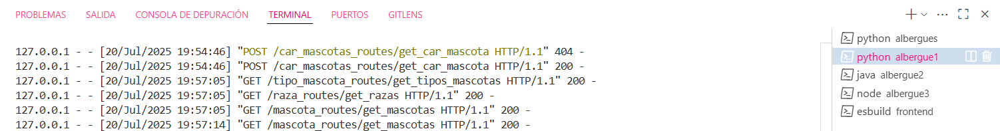
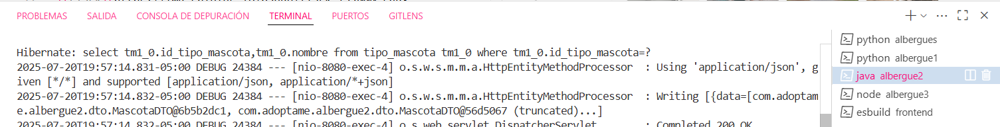
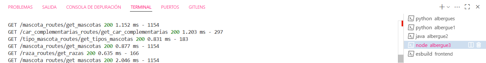

# Adóptame












## 1. Descripción del proyecto
Adóptame es un proyecto implementado como plataforma con microservicios que tiene como finalidad integrar los datos de los albergues de mascotas de Lima en un solo espacio, con la finalidad de facilitar la adopción desde un único punto de acceso.

## 2. Estado del proyecto


## 3. Tecnologías utilizadas


### Microservicio principal


### Microservicio hijo 1


### Microservicio hijo 2


### Microservicio hijo 3


### Frontend


## 4. Guía de instalación
1. Clonar el repositorio en su IDE:
    ```
    https://github.com/caroSeminario23/TAD_Adoptame.git
    ```

2. Crear las bases de datos para cada microservicio y ejecutar los scripts para la estructura y población de datos.

3. Configurar los siguientes archivos (de acuerdo con las plantillas del repositorio):
    - .env (para los servicios de Flask y Express)
    - application.properties (para el servicio en SpringBoot)

4. Guardar los cambios.

5. Crear entornos virtuales los servicios de Python y acceder a ellos.

6. Desplegar los servidores del backend en local:
    - Principal: ```python app.py```
    - Hijo 1: ```python app.py```
    - Hijo 2: ```mvn spring-boot:run```
    - Hijo 3: ```node app.js```

7. Desplegar la página web del frontend en local: ```ng serve```

## 5. Licencia
[](./LICENSE)

## 6. Autores
- Carolina Seminario (caroSeminario23) → Backend y frontend
- Fiorella Perez → Frontend
- Jhosselin Clemente → Frontend
- Jamil Tuncar (JamilTuncarQ) → Backend
- Leo Soto → Frontend
- Jesús Vasquez → Frontend
- Wilson Leyva → Frontend